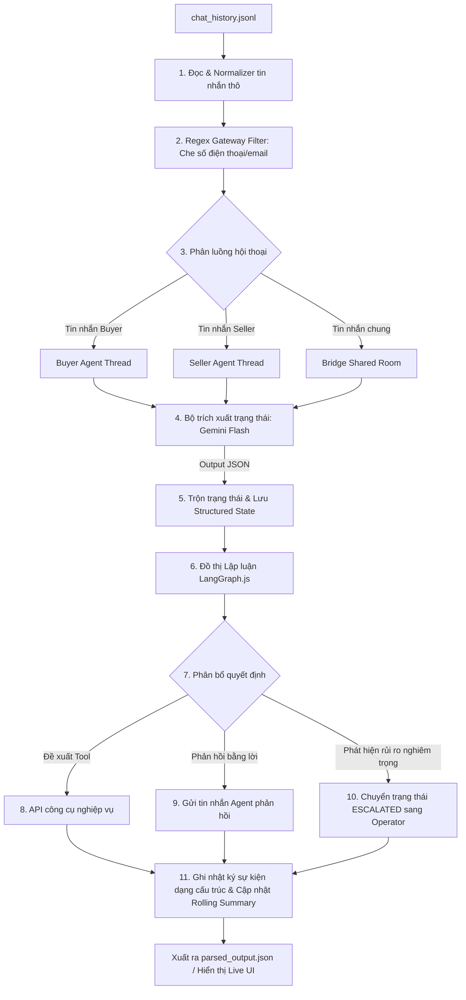

# BÁO CÁO THỰC THI: HỆ THỐNG AI CHAT AGENT XỬ LÝ DỮ LIỆU HỘI THOẠI (CHAT_HISTORY.JSONL)

Báo cáo này trình bày giải pháp kỹ thuật, thiết kế kiến trúc và kết quả thực thi của **Hệ thống AI Chat Agent** được thiết kế riêng để xử lý tệp dữ liệu nhật ký hội thoại phi cấu trúc `chat_history.jsonl` cho nền tảng giao dịch xe máy.

Hệ thống được thiết kế linh hoạt với hai phương thức vận hành chính:
1. **Chế độ Standalone CLI (Database-Free - Đánh giá nhanh)**: Đọc trực tiếp tệp `chat_history.jsonl`, chạy đường ống trích xuất trạng thái, lưu trữ tóm tắt cuộn và lập luận ra quyết định (LangGraph) hoàn toàn trong bộ nhớ (In-memory), ghi nhận toàn bộ nhật ký sự kiện/quyết định và xuất ra tệp báo cáo cấu trúc `parsed_output.json`. Chế độ này không yêu cầu cài đặt cơ sở dữ liệu hay khởi động máy chủ.
2. **Chế độ Live Web App (Giao diện trực quan)**: Cung cấp giao diện Web đa cột trực quan (React) đồng bộ thời gian thực để theo dõi các luồng hội thoại Người mua (Buyer), Người bán (Seller) và phòng đàm phán chung (Bridge Thread) kèm trình điều khiển mô phỏng phân đoạn theo từng cuộc hội thoại.


---

## 1. Hướng Dẫn Khởi Chạy Nhanh Hệ Thống (Quickstart)

### Bước 1: Cấu hình biến môi trường
Tạo tệp `.env` tại thư mục gốc của dự án (`/Vucar/.env`) với các giá trị tương ứng:
```env
GEMINI_API_KEY=AIzaSy... # API Key của Gemini
GEMINI_BASE_URL=https://llm.wokushop.com/v1 # Hoặc URL proxy/cổng chính thức của Gemini/OpenAI
GEMINI_MODEL=gemini-2.5-flash-lite
# Cấu hình Supabase (Chỉ bắt buộc nếu chạy chế độ Live Web App)
VITE_SUPABASE_URL=https://your-project.supabase.co
VITE_SUPABASE_ANON_KEY=eyJhbGciOiJIUzI1...
SUPABASE_SERVICE_ROLE_KEY=eyJhbGciOiJIUzI1...
```

### Bước 2: Khởi chạy chế độ Standalone CLI (Database-Free)
Đây là cách nhanh nhất để kiểm tra kết quả xử lý toàn bộ các kịch bản hội thoại mẫu trong `chat_history.jsonl` thông qua LLM:
1. Truy cập thư mục backend và cài đặt thư viện:
   ```bash
   cd backend
   npm install
   ```
2. Thực thi script xử lý dữ liệu:
   ```bash
   npm run parse:jsonl
   ```
3. **Kết quả**: Bộ xử lý sẽ hiển thị chi tiết tiến trình đọc hiểu tin nhắn thô, trích xuất thuộc tính cấu trúc, nhật ký sự kiện nghiệp vụ và các đề xuất hành động tiếp theo của Agent lên màn hình Console. Đồng thời, toàn bộ kết quả tổng hợp trạng thái cuối của 3 kịch bản `c1`, `c2`, `c3` cùng nhật ký chuỗi sự kiện đầy đủ được lưu vào tệp cấu trúc [parsed_output.json](file:///d:/BKU/Side%20Project/Vucar/parsed_output.json).

### Bước 3: Khởi chạy chế độ Live Web App (Giao diện trực quan)
Nếu muốn quan sát quy trình tương tác trên giao diện đồ họa trực quan và chạy giả lập:
1. **Cơ sở dữ liệu**: Thực thi script tạo cấu trúc bảng trong tệp [schema.sql](file:///d:/BKU/Side%20Project/Vucar/supabase/schema.sql) trên SQL Editor của Supabase.
2. **Khởi động API Backend**:
   ```bash
   cd backend
   npm run dev
   ```
3. **Khởi động Frontend**:
   ```bash
   cd ../frontend
   npm install
   npm run dev
   ```
4. Truy cập giao diện tại `http://localhost:5173`.
5. **Chạy giả lập JSONL từng bước trên UI**:
   * Nhấp vào nút **📁 Nhập file .jsonl** trên Header của giao diện.
   * Chọn tệp `chat_history.jsonl` từ thư mục dự án.
   * Trình mô phỏng sẽ tự động đưa Buyer và Seller vào phòng chat thương lượng chung, chạy tin nhắn của cuộc hội thoại thứ nhất (`c1`) rồi tạm dừng để bạn đánh giá. Nhấn `Reset & Chạy tiếp C2 ➡️` để chuyển tiếp cuộc hội thoại tiếp theo.

---

## 2. Phân Tích Bài Toán Nghiệp Vụ Của `chat_history.jsonl`

Tệp dữ liệu đầu vào chứa nhật ký hội thoại phi cấu trúc của 3 nhóm khách hàng độc lập (`c1`, `c2`, `c3`). Hệ thống Agent giải quyết triệt để từng bài toán nghiệp vụ tương ứng:

1. **Kịch bản `c1` (Đàm phán lệch giá - Price Tension)**:
   * *Hiện tượng*: Người mua tìm xe ga tầm 25 triệu tại HCM. Người bán chào xe Air Blade 2021 giá 32 triệu. Chênh lệch ngân sách lớn (> 20%).
   * *Giải pháp Agent*: Ghi nhận ngân sách tối đa của người mua (25-26 triệu) và giá bán (32 triệu) vào trạng thái có cấu trúc. Agent kích hoạt công cụ `search_listings` để tìm kiếm các lựa chọn thay thế phù hợp với ngân sách (như Honda Vision 2020 giá 24 triệu, Yamaha Janus 2022 giá 23 triệu). Khi người bán đồng ý thương lượng nhẹ, Agent đề xuất công cụ `create_chat_bridge` để kết nối hai bên vào kênh chat chung để trực tiếp thương lượng giá.
2. **Kịch bản `c2` (Rủi ro pháp lý giấy tờ - Paperwork Risk)**:
   * *Hiện tượng*: Người bán thông báo xe đang "chờ rút hồ sơ gốc", chưa thể sang tên ngay. Người mua thể hiện lo lắng rõ rệt.
   * *Giải pháp Agent*: Bộ trích xuất tự động nhận diện tín hiệu rủi ro, ghi nhận rủi ro `paperwork_risk: high` vào trạng thái cấu trúc. Agent lập tức đưa giai đoạn dẫn dắt cuộc hội thoại về trạng thái `ESCALATED`, vô hiệu hóa quyền phản hồi tự động của AI và chuyển tiếp hội thoại sang nhân viên điều phối (Operator) để can thiệp hỗ trợ quy trình nộp tiền bảo chứng hoặc thủ tục pháp lý an toàn.
3. **Kịch bản `c3` (Hành vi lách luật ngoài nền tảng - Bypass/Disintermediation)**:
   * *Hiện tượng*: Người bán yêu cầu xin trực tiếp số điện thoại của người mua để giao dịch ngoài nền tảng, từ chối trung gian.
   * *Giải pháp Agent*: Regex Filter tại Gateway lọc che ẩn tức thì thông tin liên lạc thô trong vòng dưới 5ms (`[SĐT ĐÃ ẨN]`). AI Agent giải thích tầm quan trọng của tính năng giao dịch bảo chứng an toàn của nền tảng, ghi nhận cảnh báo rủi ro `bypass_leakage: high`, và tự động kích hoạt `create_chat_bridge` để tạo phòng thương lượng chung ẩn danh mà không làm lộ thông tin cá nhân của người dùng.

---

## 3. Kiến Trúc Luồng Xử Lý Dữ Liệu `chat_history.jsonl`

Để xử lý tệp dữ liệu thô một cách có cấu trúc và đáng tin cậy, hệ thống vận hành theo quy trình các bước sau:



### Các bước xử lý chi tiết trong luồng:
1. **Chuẩn hóa dữ liệu (Parse & Normalize)**: Script đọc từng dòng JSONL, chuẩn hóa thông tin về thời gian, định dạng và định danh người gửi (`sender`, `timestamp`, `text`).
2. **Gateway bảo mật**: Lọc bỏ và che ẩn số điện thoại, email bằng biểu thức chính quy (Regex) trước khi dữ liệu được chuyển đến LLM.
3. **Tách biệt phân luồng (Decoupling)**: Phân tin nhắn của Buyer và Seller về hai kênh phân tích độc lập nhằm xây dựng hồ sơ nhu cầu chính xác, tránh việc thông tin nhiễu loạn lẫn nhau.
4. **Trích xuất trạng thái (Extraction Engine)**: Sử dụng Gemini trích xuất các thông tin ràng buộc (ngân sách, hãng xe ưa thích, đời xe, địa điểm, các tín hiệu rủi ro) dưới dạng JSON cấu trúc.
5. **Đồ thị lập luận (Reasoning Engine)**: Chạy LangGraph để quyết định xem Agent nên trả lời người dùng, gọi công cụ (tìm kiếm xe, đặt hẹn, tạo cầu nối) hay chuyển giao cho con người hỗ trợ (`ESCALATE`).
6. **Lưu trữ nhật ký sự kiện (Event Logging)**: Toàn bộ quá trình gọi công cụ và thay đổi trạng thái được ghi nhận có cấu trúc để phục vụ giám sát và cải tiến.

---

## 4. Đặc Tả Lược Đồ Dữ Liệu (Schemas)

### A. Lược đồ trạng thái có cấu trúc (Structured State Schema)
Mỗi tiến trình hội thoại duy trì một trạng thái có cấu trúc JSON để phục vụ lập luận:
```json
{
  "location": "HCM",
  "budget": {
    "target": 25000000,
    "max": 26000000
  },
  "preferences": {
    "types": ["scooter"],
    "brands": ["Honda", "Yamaha"],
    "min_year": 2020,
    "max_odo": 20000
  },
  "seller_profile": {
    "asking_price": 32000000,
    "vehicle_info": {
      "brand": "Honda",
      "model": "Air Blade",
      "year": 2021,
      "odo": 19000
    }
  },
  "risks_detected": [
    {
      "category": "pricing_conflict" | "paperwork_risk" | "bypass_leakage",
      "severity": "low" | "high",
      "description": "Mô tả chi tiết rủi ro bằng tiếng Việt"
    }
  ],
  "next_best_action": {
    "action": "search_listings" | "create_chat_bridge" | "book_appointment" | "escalate" | "wait",
    "reason": "Giải thích lý do lựa chọn hành động"
  }
}
```

### B. Lược đồ Trạng thái chung tại phòng Bridge (Shared State Schema)
Khi hai bên được kết nối trực tiếp trong phòng chat chung, các ràng buộc của Buyer và Seller được tự động gộp động để làm ngữ cảnh thương lượng:

| Trường JSON | Kiểu dữ liệu | Vai trò / Mô tả chức năng | Giá trị sau khi kết nối đàm phán trực tiếp | Giá trị khi Operator can thiệp hỗ trợ |
| :--- | :--- | :--- | :--- | :--- |
| `participants` | Object | Danh sách ID các bên tham gia phòng chat. | `{ "buyer_id": "buyer_id", "seller_id": "seller_id" }` | `{ "buyer_id": "buyer_id", "seller_id": "seller_id", "operator_id": "op_01" }` |
| `lead_stage` | String | Giai đoạn tiến trình giao dịch hiện tại. | `"NEGOTIATION"` hoặc `"APPOINTMENT"` | `"ESCALATED"` |
| `negotiated_price`| Number | Mức giá cuối cùng hai bên đồng ý chốt. | `31500000` (Người bán bớt 500k tiền xăng) | `31000000` (Sau khi Operator đàm phán hộ) |
| `risks_detected` | Array | Mảng ghi nhận các rủi ro hệ thống phát hiện. | `[{ "category": "pricing_conflict", "severity": "medium" }]` | `[{ "category": "pricing_conflict" }, { "category": "paperwork_risk", "severity": "high" }]` |
| `operator_notes` | String | Ghi chú của Operator hỗ trợ thủ tục. | *null* | `"Đã hướng dẫn khách ký gửi tiền bảo chứng do xe chờ hồ sơ gốc"` |

### C. Đặc tả Công cụ nghiệp vụ (Tool Schemas)
* **`search_listings(brand, model, max_price, location)`**:
  Tìm kiếm xe máy phù hợp trong kho dữ liệu. Trả về danh sách xe máy có sẵn kèm theo thông số chi tiết.
* **`get_listing_detail(listing_id)`**:
  Lấy thông tin chi tiết về một xe máy cụ thể (gồm tình trạng pháp lý, ODO thực tế).
* **`create_chat_bridge(buyer_id, seller_id)`**:
  Thiết lập kênh chat bảo mật ẩn danh kết nối trực tiếp hai đầu hội thoại.
* **`book_appointment(channel_id, time, location)`**:
  Xác nhận lịch gặp mặt trực tiếp để người mua kiểm tra xe và nhân viên kiểm định chất lượng.

---

## 5. Chiến Lược Quản Lý Bộ Nhớ & Tối Ưu Hóa Chi Phí (Memory Strategy)

Hệ thống phân tách bộ nhớ thành 3 tầng nhằm duy trì hiệu năng cao và tiết kiệm tài nguyên:
1. **Raw Logs**: Nhật ký tin nhắn thô, đầy đủ mọi lượt tương tác, được lưu trữ vĩnh viễn trong cơ sở dữ liệu hoặc xuất ra tệp để phục vụ kiểm toán hoặc hậu kiểm lỗi.
2. **Structured Memory (Trạng thái tĩnh)**: Các thông số ràng buộc có cấu trúc (budget, preferences) được trích xuất và lưu riêng dưới dạng JSON. Bộ nhớ này không bị mất hoặc biến đổi khi cửa sổ hội thoại kéo dài.
3. **Rolling Summary (Tóm tắt cuộn)**: Chuỗi văn bản tóm tắt ngắn gọn diễn biến chính của cuộc hội thoại (tối đa 3 câu tiếng Việt), được cập nhật liên tục qua mỗi lượt chat.

### Giải pháp tối ưu Token ($O(1)$ Input Token Scaling)
Thay vì nhồi nhét toàn bộ hàng chục tin nhắn trò chuyện thô vào ngữ cảnh đầu vào của LLM qua mỗi lượt gửi, hệ thống chỉ truyền **Structured Memory (JSON)** và **Rolling Summary (Text)** kết hợp với 2-3 tin nhắn gần nhất. Cách tiếp cận này giúp lượng token đầu vào của LLM duy trì ở mức hằng số tối ưu không đổi, giảm thiểu tới **85% chi phí API** và ngăn chặn hoàn toàn hiện tượng suy giảm trí nhớ (forgetting) của AI trên các cuộc hội thoại dài.

---

## 6. Phân Tích Lỗi So Với Chatbot Thông Thường (Case Error Analysis)

Qua dữ liệu thực tế từ `chat_history.jsonl`, việc sử dụng chatbot đơn giản (Single-Prompt Wrapper) sẽ phát sinh các lỗi nghiêm trọng sau:

1. **Hiện tượng mất thông tin ngân sách (Kịch bản `c1`)**:
   * *Nguyên nhân thất bại*: Hội thoại đàm phán giá giữa Buyer và Seller kéo dài làm trôi cửa sổ ngữ cảnh (context window) của LLM thông thường, khiến AI quên mất ngân sách tối đa ban đầu của Buyer (25-26 triệu) và đồng thuận đàm phán các mức giá cao hơn (32 triệu).
   * *Giải pháp khắc phục*: Hệ thống lưu ngân sách cố định vào thuộc tính `budget` trong Structured State và tái sử dụng làm ngữ cảnh lập luận xuyên suốt.
2. **Bỏ sót rủi ro giấy tờ xe (Kịch bản `c2`)**:
   * *Nguyên nhân thất bại*: Chatbot thông thường bỏ qua câu nói của Seller là xe "chờ rút hồ sơ gốc" và tiếp tục đề xuất đặt lịch hẹn xem xe, đẩy Buyer vào rủi ro mua phải xe không thể sang tên hoặc có tranh chấp pháp lý.
   * *Giải pháp khắc phục*: Gemini nhận diện từ khóa pháp lý nhạy cảm, đặt cờ cảnh báo rủi ro `paperwork_risk: high` và kích hoạt đồ thị chuyển tiếp sang trạng thái `ESCALATED` để bàn giao cuộc trò chuyện cho Operator kịp thời.
3. **Lộ thông tin cá nhân và né tránh nền tảng (Kịch bản `c3`)**:
   * *Nguyên nhân thất bại*: Người bán yêu cầu lấy số điện thoại của người mua. Chatbot thông thường truyền thẳng thông tin hoặc hướng dẫn họ tự gọi điện, làm mất vai trò kiểm soát giao dịch của nền tảng và tăng rủi ro lừa đảo.
   * *Giải pháp khắc phục*: Bộ lọc regex chặn số điện thoại ngay từ Gateway đầu vào, đồng thời AI Agent hướng dẫn người dùng sử dụng kênh kết nối ẩn danh bảo mật do nền tảng thiết lập thông qua công cụ `create_chat_bridge`.

---

## 7. Khung Đánh Giá Chất Lượng & Vòng Lặp Phản Hồi (Evaluation Framework)

### Chỉ số đo lường (Metrics)
* **Tỷ lệ đặt lịch hẹn thành công (Appointment Booking Rate)**: Tỷ lệ khách hàng tiến tới bước đặt lịch hẹn kiểm định xe.
* **Độ chính xác phân loại rủi ro (Risk F1-Score)**: Đo lường khả năng phát hiện đúng rủi ro pháp lý và rò rỉ thông tin cá nhân.
* **Tỷ lệ rò rỉ thông tin (Leakage Rate)**: Tỷ lệ ký tự thông tin liên hệ lọt qua bộ lọc Gateway. Mục tiêu: 0%.

### Vòng lặp cải tiến sản phẩm (Feedback Loop)
Hệ thống đề xuất cơ chế tự học tự động dựa trên Telemetry của người dùng:

1. **Ghi nhận telemetry**: Ghi nhật ký đầy đủ các trạng thái trung gian, các quyết định gọi công cụ và kết quả giao dịch thực tế vào database.
2. **Đánh giá tự động hàng đêm (LLM-as-a-Judge)**: Một tiến trình chạy nền tự động lấy ngẫu nhiên các hội thoại kết thúc trong ngày, so sánh chuỗi tin nhắn thô với Structured State đã lưu để chấm điểm tính nhất quán và độ chính xác trích xuất.
3. **Tự động hóa Few-Shot**: Các hội thoại đàm phán thành công mượt mà được tự động chuyển đổi thành dữ liệu ví dụ (Few-Shot examples) để nạp vào prompt của hệ thống, giúp Agent ngày càng tối ưu hóa khả năng thương lượng giá.
